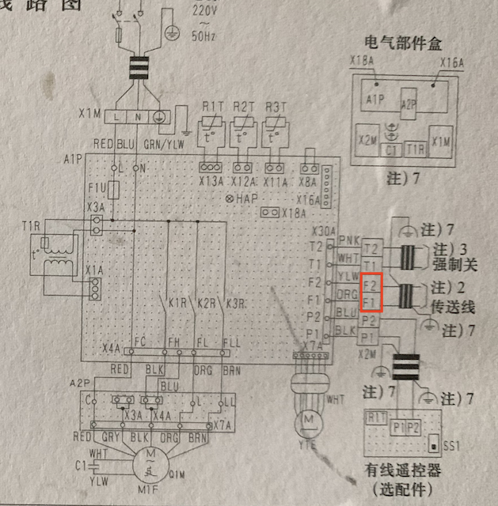
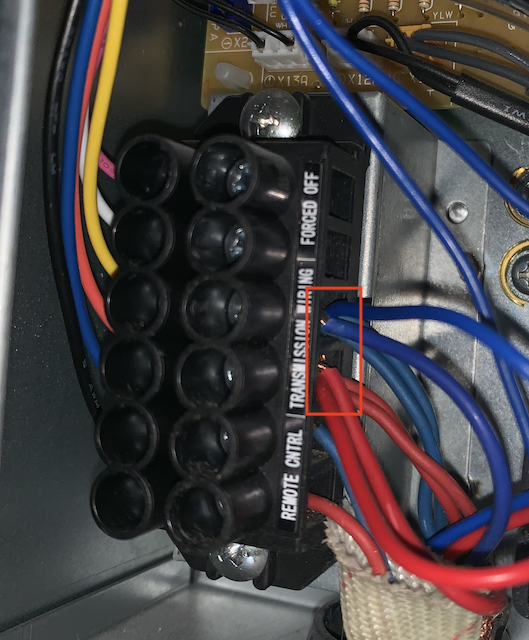
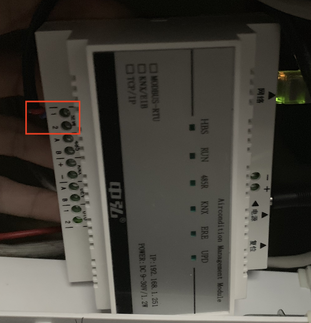
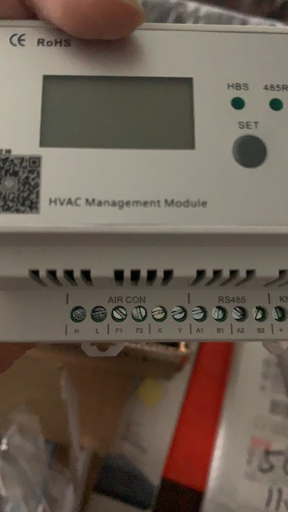
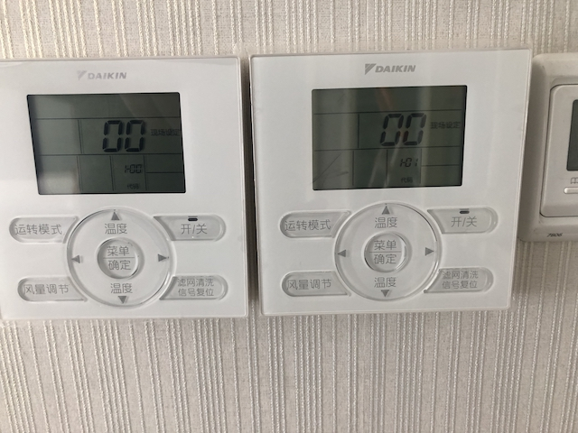

# 中弘空调网关的作弊条

中弘网关也算是一个神器了，前前后后用了三个型号了，整体来讲这个东东很稳定，硬件产品产品化做的非常不错，软件产品上也尝试花了不少功夫。

## 空调接入中弘网关


### 大金

#### 空调机接线

开头先说明一下，大金的空调很贵，施工烂到渣、干活快糙猛，大家当心。只要是一个中央空调下的任何一个室内机接入它的F1、F2就可以了，数据线的另一头接网关的空调1、2。

我们看看大金的线路说明：



这个F1、F2有时看不见，因为它是在里面，在外面就是TRANSMISSION WIRING口了，你只需要将线与原来的线缠绕在一起使出吃屎的力量拧进去就好了（UP主是真拿出了看家的本领拧这根线）



## 网关接线

### '老'网关

老的网关不同的空调要使用不同的网关，我用了几个。从空调机上接出来的线接到它的空调下的1、2即可。



### '新'网关
新网关通过dip开关设置不同的空调主机。从空调上接出来的线格力接到H、L上，日系空调接到F1、F2上



## 空调设置

### 大金空调

#### 超大控制面板

在2017年及以前出货的空调会看到这样的面板



你需要同时按风量调节、信号复位两个按钮几秒后进入```现场设定```，将家中的每个面板依次设置为00 代码1-00、1-01...注意不要重复。如上图。
